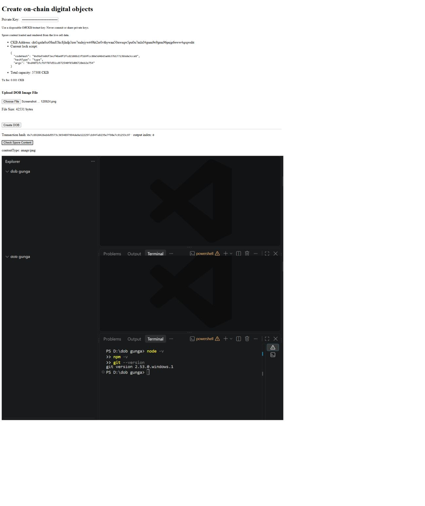

# Create a DOB — Nervos CKB campaign submission

This repository documents my completion of the Nervos **Create a DOB** tutorial with OffCKB and Spore-SDK. The app takes an image, stores its MIME type and bytes in a Spore cell, reads that cell back by transaction outpoint, and reconstructs the picture in the browser.



## Campaign checklist

| Requirement | Current proof |
| --- | --- |
| Run OffCKB locally | [OffCKB node and RPC screenshot](evidence/tutorial-run/Screenshot%202026-08-24%20121235.png) |
| Deploy an on-chain picture with Spore-SDK | [DOB transaction returned by the local tutorial](evidence/tutorial-run/Screenshot%202026-08-24%20133311.png) |
| Render the picture from the digital object | [Retrieved `image/jpeg` content](evidence/tutorial-run/Screenshot%202026-08-24%20133348.png) and [final browser render](evidence/tutorial-run/Screenshot%202026-08-24%20133448.png) |
| Deploy the app against CKB testnet | [Fresh committed transaction](https://pudge.explorer.nervos.org/transaction/0x7c6928426eb6d5573c3654897994de8e12225fcb94fe8235e7f98e7c91253c97) and [live-cell browser render](evidence/testnet-dob-render.png) |
| Share a reflection | [What I learned about DOBs, NFTs, and debugging](REFLECTION.md) |

The original chronological screenshots prove the local tutorial. The separate testnet captures prove a fresh mint from a disposable testnet account, public explorer confirmation, and browser rendering from the committed live cell.

## Quick review links

Open these links directly on GitHub:

- [Evidence index](https://github.com/zuhdev/dob-tutorial/blob/main/evidence/README.md)
- [Step 3 — OffCKB running](https://github.com/zuhdev/dob-tutorial/blob/main/evidence/tutorial-run/Screenshot%202026-08-24%20121235.png)
- [Step 7 — Parcel port recovery](https://github.com/zuhdev/dob-tutorial/blob/main/evidence/tutorial-run/Screenshot%202026-08-24%20122911.png)
- [Step 10 — DOB transaction hash](https://github.com/zuhdev/dob-tutorial/blob/main/evidence/tutorial-run/Screenshot%202026-08-24%20133311.png)
- [Step 11 — Spore content retrieved](https://github.com/zuhdev/dob-tutorial/blob/main/evidence/tutorial-run/Screenshot%202026-08-24%20133348.png)
- [Step 12 — Picture rendered from DOB](https://github.com/zuhdev/dob-tutorial/blob/main/evidence/tutorial-run/Screenshot%202026-08-24%20133448.png)
- [Fresh testnet transaction in Pudge](https://pudge.explorer.nervos.org/transaction/0x7c6928426eb6d5573c3654897994de8e12225fcb94fe8235e7f98e7c91253c97)
- [Fresh testnet browser render](https://github.com/zuhdev/dob-tutorial/blob/main/evidence/testnet-dob-render.png)
- [Fresh testnet explorer capture](https://github.com/zuhdev/dob-tutorial/blob/main/evidence/testnet-transaction-explorer.png)
- [Full screenshot folder](https://github.com/zuhdev/dob-tutorial/tree/main/evidence/tutorial-run)
- [Reflection](https://github.com/zuhdev/dob-tutorial/blob/main/REFLECTION.md)
- [App source](https://github.com/zuhdev/dob-tutorial/blob/main/index.tsx)
- [Validation workflow](https://github.com/zuhdev/dob-tutorial/blob/main/.github/workflows/validate.yml)

## Transaction links

- **Local OffCKB transaction:** `0x7678ce441d722bcd13d0f0622d7542b521c9a29647a72afec5fc97919ba468a6` — [open the transaction-hash proof](https://github.com/zuhdev/dob-tutorial/blob/main/evidence/tutorial-run/Screenshot%202026-08-24%20133311.png). This hash belongs to the local devnet at `127.0.0.1:28114`, so it is not queryable in a public testnet explorer.
- **Fresh testnet DOB transaction:** `0x7c6928426eb6d5573c3654897994de8e12225fcb94fe8235e7f98e7c91253c97`, output index `0` — [open it in Pudge Explorer](https://pudge.explorer.nervos.org/transaction/0x7c6928426eb6d5573c3654897994de8e12225fcb94fe8235e7f98e7c91253c97).
- **Testnet faucet transaction:** `0x62d84aca644d25af3b6780d7fa86cc3a5b6ddb6adb2649f2babeb3a37a546459` — [open the funding transaction in Pudge Explorer](https://pudge.explorer.nervos.org/transaction/0x62d84aca644d25af3b6780d7fa86cc3a5b6ddb6adb2649f2babeb3a37a546459).

The fresh DOB output is a live Spore cell with `image/png` content and 42,531 payload bytes. The on-chain payload SHA-256, `b6d61a0a7ae18ce202c37ab7f8d0b113471b38a8e8c3b839767aebd1715b02bb`, matches the uploaded source file exactly.

## What the app proves

The image shown at the end is not a local file preview. After minting, the app uses the transaction hash and output index to query the live CKB cell, decodes the Spore data, converts the returned bytes into a browser `Blob`, and renders that result.

```text
local image bytes
       |
       v
Spore-SDK transaction -> CKB Spore cell
                               |
                               v
                    query live cell by outpoint
                               |
                               v
                 unpack bytes -> Blob -> image
```

The app supports both networks through `NETWORK`:

- `devnet` uses the OffCKB RPC proxy at `http://localhost:28114` and the exported local scripts.
- `testnet` uses the public CKB testnet client and the predefined Spore testnet configuration.

## Evidence

All 12 screenshots supplied for the campaign are stored unchanged in [`evidence/tutorial-run`](evidence/tutorial-run). The fresh testnet render and explorer captures are stored separately in [`evidence`](evidence). The complete step-by-step index is in [`evidence/README.md`](evidence/README.md); [`SHA256SUMS.txt`](evidence/tutorial-run/SHA256SUMS.txt) and [`testnet-SHA256SUMS.txt`](evidence/testnet-SHA256SUMS.txt) record the files' exact hashes.

The evidence intentionally includes the recoverable problems encountered along the way:

- npm installation warnings and audit findings;
- a Parcel default-port collision, followed by a successful alternate port;
- dependency and browser-RPC compatibility debugging described in the reflection.

## Run locally

Requirements: Node.js 20, npm, and [OffCKB](https://docs.nervos.org/docs/getting-started/quick-start).

```powershell
git clone https://github.com/zuhdev/dob-tutorial.git
Set-Location '.\dob-tutorial'
npm ci
```

Start the OffCKB tutorial flow in two terminals:

```powershell
# Terminal 1
offckb node
```

```powershell
# Terminal 2
$env:NETWORK = 'devnet'
npm start
```

Use only the disposable local account printed by `offckb accounts`. Select an image, click **Create DOB**, wait for the transaction hash, and then click **Check Spore Content** to render the bytes retrieved from the cell.

## Fresh testnet result

The testnet flow was repeated on August 25, 2026 with a fresh disposable signer:

- App network: CKB testnet via `NETWORK=testnet`.
- DOB transaction: [`0x7c692842...253c97`](https://pudge.explorer.nervos.org/transaction/0x7c6928426eb6d5573c3654897994de8e12225fcb94fe8235e7f98e7c91253c97).
- Output index: `0`.
- Spore ID: `0xf2c2cd67d6bcbf1c716185fd9d9bee5a7c60f9dce2947253d64dca68784cccce`.
- Explorer block height: `22,199,298`.
- Returned content: `image/png`, 42,531 bytes.
- Verification: the app queried the live cell, unpacked the Spore bytes, and rendered the image in the browser.

The disposable private key is masked in the capture and is not stored in this repository.

## Validate

```powershell
npm ci
npm run lint
$env:NETWORK = 'testnet'
npm run build
```

The same checks run automatically through [`.github/workflows/validate.yml`](.github/workflows/validate.yml).

## Security

The key field is runtime-only and no private key is committed in the source. Several original screenshots display a disposable OffCKB devnet key, so that local account must be considered permanently compromised. Never fund it on testnet or mainnet.

Campaign resources: [OffCKB Quick Start](https://docs.nervos.org/docs/getting-started/quick-start) and [Create a DOB](https://docs.nervos.org/docs/dapp/create-dob).
